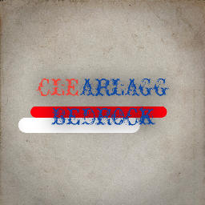

# ✨ ClearLagg Bedrock

  

  Add-on **anti-lag** untuk Minecraft Bedrock server 🎮  
  Membersihkan entity berlebih agar server tetap ringan ⚡

---

  
  
  

---

## 🚀 Fitur Utama
- 🧹 **Clear Entity Otomatis** → hapus mob/item berlebih secara berkala  
- ⚡ **Optimasi Performa** → server tetap ringan walau banyak pemain  
- 🔄 **Kompatibel** → selalu update untuk Minecraft Bedrock terbaru  
- 🎛️ **Instalasi Mudah** → cukup sekali klik import  

---

## 📥 Download
📌 Versi terbaru tersedia di halaman **[Releases](https://github.com/YourGitHubRepo/releases)**  

---

## 🛠️ Cara Pakai
1. Download file `.mcaddon` dari [Releases](https://github.com/YourGitHubRepo/releases)  
2. Klik 2x file → otomatis terbuka di Minecraft Bedrock  
3. Aktifkan **Behavior Pack** pada dunia/server kamu  
4. Nikmati server yang lebih ringan 🚀  

---

## 👥 Komunitas
Bergabung dengan komunitas untuk diskusi, tips, dan update terbaru:  

- 💬 [WhatsApp Group](https://chat.whatsapp.com/LinkGrupKamu)  
- 🎧 [Discord Server](https://discord.gg/LinkDiscordKamu)  

---

## ☕ Dukung Kami
Mau addon ini terus update? Traktir kopi ☕:  
  

---

## 📌 Credits
Dibuat dengan ❤️ oleh komunitas **Minecraft Indonesia** 🇮🇩  
Kontributor & pengguna adalah bagian besar dari proyek ini ✨  

---

  Made with ♥️ for Minecraft Bedrock Community Server

